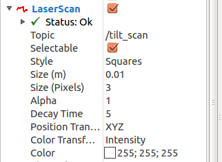

RViz User's Guide
=================

Troubleshooting
---------------

If you're running into problems and have not seen the answer below, try the `Troubleshooting Page <http://wiki.ros.org/rviz/Troubleshooting>`_.

Build/Startup
---------------

First satisfy any system dependencies.::

  rosdep install rviz

Now build the visualizer::

  rosmake rviz

Then start the visualizer::

  rosrun rviz rviz

When rviz starts for the first time, you will see an empty view:

The central area with the grid is the 3D view. On the left is the
Displays list, which will show any displays you have loaded. Right now
it just contains the global options and the time view, which I'll get
to later. On the right are some of the other panels, described below.

Displays
--------

A display is something that draws something in the 3D world, and
likely has some options available in the displays list. An example is
a point cloud, the robot state, etc.

For the current list of RViz display types, see `RViz Display Types
<http://wiki.ros.org/rviz/DisplayTypes>`_.

Adding a new display
....................

To add a display, type "control-N" (for "new") or click the Add button
at the bottom:

This will pop up the new display dialog:

The list at the top shows the available display types, grouped by the
plugin that provides them. The text box in the middle gives a
description of the selected display type. At the bottom you can give a
name to the new instance of the display, which defaults to the name of
the type name.

Display Properties
..................

Each display gets its own list of properties. For example:

Display Status
..............

Each display gets its own status to help let you know if everything is
OK or not. The status can be one of 4: OK, Warning, Error and
Disabled. The status is indicated in the display's title by the text
color and icon, as well as in the Status category that you can see if
the display is expanded:

The Status category also expands to show specific status
information. This information is different for different displays, and
the messages should be self explanitory.  The top-level status level
for the display is set based on the worst of the sub-statuses.

Organizing Displays
...................

You can move displays up or down in the list by dragging them with the
left mouse button.  You can select multiple displays and drag them
together.  You can also create a "Group" display, which serves as a
container for other displays.  Displays in a group can be enabled and
disabled together with the group's checkbox.  In this example, the
"Sensor data" group has been disabled and the "Plans" group is
enabled:

Naming Displays
...............

In the above example, the "Group" and "Path" displays have been given
meaningful names.  You can do this either at creation time in the new
display dialog (described above) or any time later by selecting one
display and typing "control-R" (for "rename") or by clicking the
"Rename" button.

Configurations
--------------

Different configurations of displays are often useful for different
uses of the visualizer. A configuration useful for a full PR2 is not
necessarily useful for a test cart, for example. To this end, the
visualizer lets you load and save different configurations.

A configuration contains:

 * Displays and their properties
 * Tools and their properties
 * View controller type and settings for the initial viewpoint, plus saved views
 * Window layout and the list of panels

RViz treats configurations similarly to files in an editor.  When a
configuration file is opened, changes are made, and the "save" menu
(or control-"s") is triggered, the original config file is
overwritten.

When no config file is specified, rviz loads the file
``~/.rviz/default.rviz``, creating it if it does not exist.

When a config file other than the default is in use, RViz includes the
file name in the window title bar.  An asterisk ("*") next to the file
name indicates changes have been made since the last time the
configuration was loaded or saved.

The config file format is YAML.  This has changed since the Fuerte
version of RViz, so config files saved with Fuerte RViz will not load
in Groovy RViz.

Views Panel
-----------

The "Views" panel shows properties of the current view controller in
use, and optionally a list of saved views:

Clicking on a saved view ("Top view" and "Side view" above) copies
it to the "Current View" entry and activates it.

The properties of the current view change as you move the viewpoint
with the mouse in the 3D display, but they can also be edited directly
via the keyboard for precise control.

There is a combobox control labelled "Type" at the top of the Views
panel.  This lets you change the type of the current view controller.

To the right of it is the "Zero" button.  This resets the current view
controller to look at the point "0, 0, 0" from a short distance away.
This is useful to get back to a known location if the viewpoint gets
"lost".  The keyboard shortcut for "Zero" is "z".

Built-in view types
...................

"Views" in RViz are view controllers.  They control both the viewpoint
and the camera projection.  There are 4 built-in types, but more can
be added via plugins.

Orbit (default)
,,,,,,,,,,,,,,,

The orbital camera simply rotates around a focal point, while always
looking at that point. The focal point is visualized as a small disc
while you're moving the camera:

Controls:

 * Left mouse button: Click and drag to rotate around the focal point.
 * Middle mouse button: Click and drag to move the focal point in the plane formed by the camera's up and right vectors. The distance moved depends on the focal point -- if there is an object on the focal point, and you click on top of it, it will stay under your mouse.
 * Right mouse button: Click and drag to zoom in/out of the focal point. Dragging up zooms in, down zooms out.
 * Scrollwheel: Zoom in/out of the focal point
 * 'f' key: move the focal point to whatever 3D object is currently under the mouse.

XYOrbit
,,,,,,,

The "XYOrbit" view controller is similar to Orbit, but the focal point
is constrained to move only in the XY plane.  Also, the focal point is
kept lower in the window and is cyan colored.

Controls:

 * Left mouse button: Click and drag to rotate around the focal point.
 * Middle mouse button: Click and drag to move the focal point in the XY plane. The distance moved depends on the focal point -- if there is an object on the focal point, and you click on top of it, it will stay under your mouse.
 * Right mouse button: Click and drag to zoom in/out of the focal point. Dragging up zooms in, down zooms out.
 * Scrollwheel: Zoom in/out of the focal point
 * 'f' key: move the focal point to whatever 3D object is currently under the mouse.

FPS (first-person shooter)
,,,,,,,,,,,,,,,,,,,,,,,,,,

The FPS camera is a first-person camera, so it rotates as if you're looking with your head.

Controls:

 * Left mouse button: Click and drag to rotate. Control-click to pick the object under the mouse and look directly at it.
 * Middle mouse button: Click and drag to move along the plane formed by the camera's up and right vectors
 * Right mouse button: Click and drag to move along the camera's forward vector. Dragging up moves forward, down moves backward.
 * Scrollwheel: Move forward/backward

Top-down Orthographic
,,,,,,,,,,,,,,,,,,,,,

The top-down orthographic camera always looks down along the Z axis (in the robot frame), and is an orthographic view which means things do not get smaller as they get farther away.

Controls:

 * Left mouse button: Click and drag to rotate around the Z axis
 * Middle mouse button: Click and drag to move the camera along the XY plane
 * Right mouse button: Click and drag to zoom the image
 * Scrollwheel: Zoom the image

Coordinate Frames
-----------------

RViz uses the tf transform system for transforming data from the
coordinate frame it arrives in into a global reference frame. There
are two coordinate frames that are important to know about in the
visualizer. Here is a `video that explains them both <http://www.youtube.com/watch?v=rZ0xyzfG-tY>`_.

.. Should really implement a youtube directive for embedding videos.

The Fixed Frame
...............

The more-important of the two frames is the fixed frame. The fixed
frame is the reference frame used to denote the "world" frame. This is
usually the "map", or "world", or something similar, but can also be,
for example, your odometry frame.

If the fixed frame is erroneously set to, say, the base of the robot,
then all the objects the robot has ever seen will appear in front of
the robot, at the position relative to the robot at which they were
detected. For correct results, the fixed frame should not be moving
relative to the world.

If you change the fixed frame, all data currently being shown is
cleared rather than re-transformed.

The Target Frame
................

Most view controllers provide a "target frame" which provides a
reference frame for the camera view. For example, if your target frame
is the map, you'll see the robot driving around the map. If your
target frame is the base of the robot, the robot will stay in the same
place while everything else moves relative to it.  The built-in view
controllers use the target frame only for position, and ignore its
orientation, so when the robot rotates, you will see it spin, but when
in drives it will stay in the same place in the view.

Tools
-----

The visualizer has a number of tools you can use on the toolbar:

Move Camera
...........

 * Keyboard shortcut: m

The Move Camera tool is the default tool. When this is selected, the current View gets to do its thing when you click inside the 3d view.

Interact
........

 * Keyboard shortcut: i

The Interact tool allows the use of Interactive Marker displays.  When
the mouse is not over an interactive element, it behaves like the Move
Camera tool.

Select
......

 * Keyboard shortcut: s

The Select tool allows you to select items being displayed in the 3D
view. It supports single-point selection as well as click/drag box
selection.

Once objects are selected, they are surrounded by cyan-colored
bounding boxes, and information about the selected objects can be
viewed in the "Selection" panel.  Here you can see the position of the
robot link "head_tilt_link" has been expanded to show the XYZ
coordinates:

You can add to a selection with the Shift key, and remove from the
selection with the Ctrl key. If you want to move the camera around
while selecting without switching back to the Move Camera tool you can
hold down the Alt key.

The f key will focus the camera on the current selection.

2D Nav Goal
...........

 * Keyboard shortcut: g

This tool lets you set a goal sent on the "/move_base_simple/goal" ROS
topic. Click on a location on the ground plane and drag to select the
orientation.  The output topic can be changed in the "Tool Properties" panel.

This tool works with the navigation stack.

2D Pose Estimate
................

 * Keyboard shortcut: p

This tool lets you set an initial pose to seed the localization system
(sent on the "/initialpose" ROS topic). Click on a location on the
ground plane and drag to select the orientation.  The output topic can
be changed in the "Tool Properties" panel.

This tool works with the navigation stack.

Time
----

The Time panel is mostly useful when running in a simulator: it allows
you to see how much ROS Time time has passed, vs. how much "Wall
Clock" (aka real) time has passed.

The time panel also lets you reset the visualizer's internal time
state -- this causes a reset of all the displays, as well as a reset
of tf's internal cache of data.

If you are not running in simulation, the time panel is mostly
useless. In most cases it can be closed and you will probably not even
notice (other than having a bit more screen real estate for the rest
of rviz).

Plugins
-------

RViz is setup so that new displays, tools, view controllers, and
panels can be added through plugins.  Installed plugins are indexed
and made available within RViz automatically.

For information on writing your own RViz plugin, see the plugin
tutorials within `the RViz tutorials  wiki page
<http://wiki.ros.org/rviz/Tutorials>`_.
